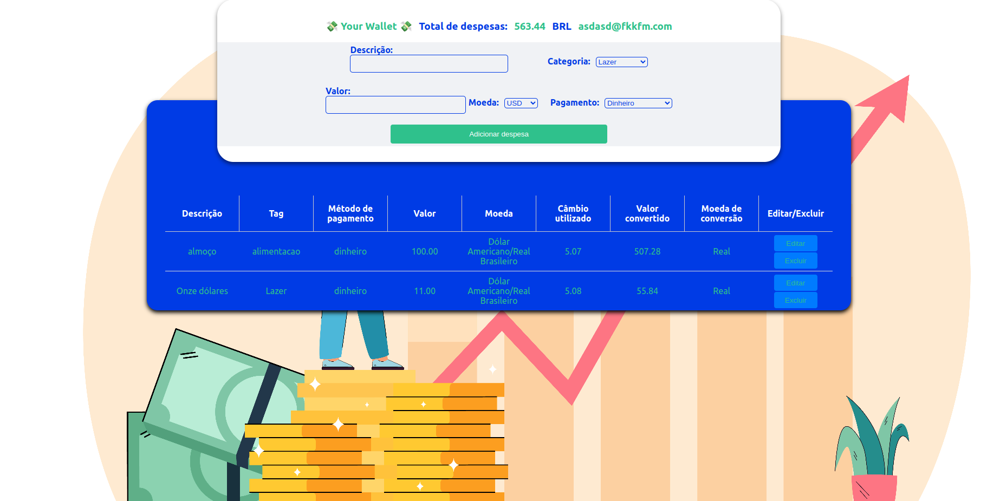

# My Project

# Contexto
Este projeto trata-se de um site de carteira para contar os gastos e que faz a conversão da moeda caso gaste além de real.

## Técnologias usadas

Front-end:
> Desenvolvido usando: React, Redux, CSS, HTML, ES

## Instalando Dependências
 
```bash
npm install
``` 
## Executando aplicação

* Para rodar o front-end:

  ```
    npm start
  ```

## Executando Testes

* Para rodar todos os testes:

  ```
    npm test
  ```

